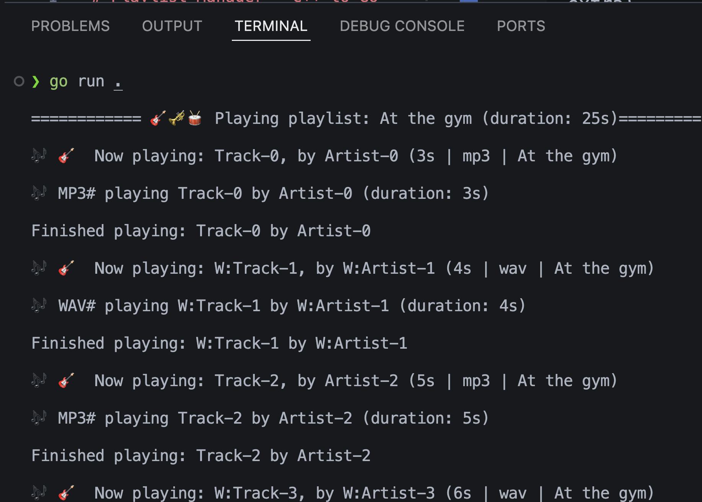

# Playlist Manager — C++ to Go Port

This project demonstrates how to port a simple **Playlist Manager** from **C++** to **Go**, while preserving core behavior and adapting to Go idioms.

It covers:

- Reading and saving playlists from disk.
- Creating a `Playlist` struct with a constructor‐like function.
- Handling tracks with different formats (`MP3`, `WAV`, etc.).
- Using value vs. pointer semantics in Go.
- Understanding subtle differences in object copying between C++ and Go.

---

## 📂 Original C++ Example

### Constructor

```cpp
explicit Playlist(string name) : name_(std::move(name)) {
    ensureFolderExists();
}
```

### Static Method — Load From Disk

```cpp
static Playlist loadFromDisk(const string &name) {
    ensureFolderExists();
    fs::path filepath = SAVE_FOLDER / (name + ".txt");
    ...
}
```

---

## 💡 Go Port

### Constructor‐Equivalent in Go

Go does not have constructors, but you can achieve the same result with a `New<Type>` function:

```go
func NewPlaylist(name string) *Playlist {
    p := &Playlist{
        name:   name,
        tracks: []Track{},
    }
    p.ensureFolderExists() // same as calling in C++ constructor
    return p
}
```

---

### Get Saved Playlists (C++ → Go)

**C++**

```cpp
static vector<string> getSavedPlaylists() {
    vector<string> names;
    ensureFolderExists();
    ...
    return names;
}
```

**Go**

```go
func (p *Playlist) GetSavedPlaylists() ([]string, error) {
    var names []string
    if err := p.ensureFolderExists(); err != nil {
        return nil, err
    }
    entries, err := os.ReadDir(SAVE_FOLDER)
    if err != nil {
        return nil, err
    }
    for _, entry := range entries {
        if !entry.IsDir() {
            names = append(names, file(entry.Name()))
        }
    }
    return names, nil
}
```

---

### Load Playlist From Disk (C++ → Go)

**C++**

```cpp
static Playlist loadFromDisk(const string &name) {
    ensureFolderExists();
    ...
    playlist.addTrack(std::move(track));
}
```

**Go**

```go
 func (p *Playlist) LoadFromDisk(name string) (*Playlist, error) {
	if er := p.ensureFolderExists(); er != nil {
		return nil, er
	}

	playlistPath := filepath.Join(".", SAVE_FOLDER, name+".txt")

	file, err := os.Open(playlistPath)

	if err != nil {
		return nil, fmt.Errorf("seems this file may not exists: %v", err)
	}

	defer file.Close()

	scanner := bufio.NewScanner(file)

	if !scanner.Scan() {
		return nil, errors.New("invalid playlist: empty file")
	}

	playlistName := strings.TrimSpace(scanner.Text())
	if playlistName == "" {
		return nil, errors.New("invalid playlist file or name")
	}

	yourPlayList := &Playlist{name: playlistName}

	for scanner.Scan() {
		line := strings.TrimSpace(scanner.Text())

		if line == "" {
			continue
		}

		parts := strings.Split(line, "|")

		if len(parts) != 5 {
			continue
		}

		title := parts[0]
		artist := parts[1]

		duration, err := strconv.Atoi(parts[2])
		if err != nil {
			fmt.Printf("Duration for this track is undefined, skipping track ->")
			continue
		}

		format := parts[3]
		extra, err := strconv.Atoi(parts[4])
		if err != nil {
			fmt.Printf("Failed to read metadata for this track, skipping track ->")
			continue
		}

		var track Track

		switch format {
		case MP3:
			track = &MP3Track{BaseTrack: BaseTrack{
				title:    title,
				format:   format,
				artist:   artist,
				duration: time.Duration(duration) * time.Millisecond,
			},
				bitrateKbps: extra,
			}
		case WAV:
			track = &WAVTrack{BaseTrack: BaseTrack{
				title:    title,
				format:   format,
				artist:   artist,
				duration: time.Duration(duration) * time.Millisecond,
			},
				sampleRateHz: extra,
			}
		default:
			track = &BaseTrack{title: title, artist: artist, format: format, duration: time.Duration(duration) * time.Millisecond}
		}

		yourPlayList.tracks = append(yourPlayList.tracks, track)

	}

	if err := scanner.Err(); err != nil {
		return nil, err
	}

	return yourPlayList, nil
}

```

---

## 📌 Notes on Pointers vs. Values in Go

- In C++, references and pointers allow direct modification of objects without copying.
- In Go, **value receivers** work on a copy of the struct — changes won’t affect the original.
- **Pointer receivers** work on the same underlying struct, so modifications persist.
- In this project, pointer receivers are used for all methods that modify the playlist to avoid unintended copies and reduce GC overhead.

---

## 🖥️ Running the Program

```bash
go run main.go
```

---

## 📸 Screenshot of Terminal Output



---

## 📜 License

MIT License
